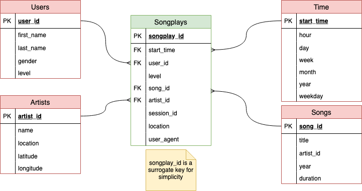

# Sparkify OLAP Database and ETL pipeline

This project supports the Analytics team at Sparkify, a recent startup providing
a web and mobile music streaming app. The team has been collecting data about their
users (the ones who gave explicit consent according to 
[GDPR](https://eur-lex.europa.eu/eli/reg/2016/679/oj) regulations).
Such data resides in a directory of JSON logs on user activity of the app and metadata of the songs
(as used by the app).
The aim of the project is to easily extract data from the JSON files, transform, and load (ETL) them into
an appropriate database suitable to obtain useful insights, e.g. which songs Sparkify's users listen to.

## About SparkifyDB

The database is not normalized because it must be ready for analytical processing. 
There is no need to modify records quickly but instead to execute queries as fast as possible 
without many aggregations (or without aggregations at all).
The following star schema describes sparkifydb.

 

As it can be seen in the Figure, there is one fact table called **songplays** and four dimension tables called respectively
**artists**, **songs**, **time**, and **users**. The star schema is self-explanatory. At the center of the schema ('the star') we can find the fact table, which is a derived table describing song, artist, time and user information all together. If there is a need of further details, foreign keys (FK) allow to retrieve, e.g., user's first_name. The key of **songplays**, i.e. songplay_id, is a surrogate key created for simplicity of indexing, so it does not naturally arises from the context. It is, in fact, autogenerated by the DBMS.

## Performance Discussion

There are issues regarding perfomance and extensibility tradeoffs who I was not able to solve
without further discussion with the team. Since the team will not be available for a while, 
I had to make some assumptions. I decided to choose extensibility and better code comprehension
over performance.

### Pandas Performance

Pandas [iterrows](https://pandas.pydata.org/pandas-docs/stable/reference/api/pandas.DataFrame.iterrows.html) is one the slowest part of the pipeline. Using [to_records](https://pandas.pydata.org/pandas-docs/stable/reference/api/pandas.DataFrame.to_records.html) would be much faster 
but it comes with a cost: losing the comprehesion and flexibility. Accessing records with indexes
instead of named columns may cause unintended effects in the future, e.g. columns order changes.

### SQL Postgres performance

Logs could be ingested directly with COPY BULK INSERTs (See [COPY](https://www.postgresql.org/docs/current/sql-copy.html) and [copy_from](https://www.psycopg.org/docs/cursor.html?highlight=arraysize).
However, this would move the ETL pipeline (partially) from pure Python to SQL. 
COPY, in fact, does not allow to modify data while copying from file, 
e.g. timestamp conversions, SELECTs. Therefore, SQL constraints (like FK, PK, etc.) must
be executed as ALTER queries after populating the tables AND cleaning them, e.g. removing duplicates.
The only SELECT (**song_select** in sql_queries.py) could be improved by creating a JOIN table between **artists** and **songs** and then creating an index based on both artist_id and song_id.

## Project Structure

The project is made of two Jupyter Notebooks and three Python scripts, along with a data directory
and a Makefile to make it easier to run.
The following tree shows an except of the project dirs.

```
|-- data
|   |-- log_data
|   |   `-- 2018
|   |       `-- 11
|   |           |-- 2018-11-01-events.json
|   |           |-- 2018-11-02-events.json
|   |           |-- 2018-11-03-events.json
|   |            ...
|   `-- song_data
|       `-- A
|           |-- A
|           |   |-- A
|           |   |   |-- TRAAAAW128F429D538.json
|           |   |   |-- TRAAABD128F429CF47.json
|           |   |   |-- TRAAADZ128F9348C2E.json
|           |   |  ...
|           |   |-- B
|           |   |   |-- TRAABCL128F4286650.json
|           |   |   |-- TRAABDL12903CAABBA.json
|           |   |   |-- TRAABJL12903CDCF1A.json
|           |     ...
|           |   `-- C
|           |       |-- TRAACCG128F92E8A55.json
|           |       |-- TRAACER128F4290F96.json
|           |       |-- TRAACFV128F935E50B.json
|           |    ...
|           `-- B
|               |-- A
|               |   |-- TRABACN128F425B784.json
|               |   |-- TRABAFJ128F42AF24E.json
|               |   |-- TRABAFP128F931E9A1.json
|               | ...
|               |-- B
|               |   |-- TRABBAM128F429D223.json
|               |   |-- TRABBBV128F42967D7.json
|               |   |-- TRABBJE12903CDB442.json
|                ...
|               `-- C
|                   |-- TRABCAJ12903CDFCC2.json
|                   |-- TRABCEC128F426456E.json
|                   |-- TRABCEI128F424C983.json
|                ...
|-- diagrams
|   `-- sparkifydb-starschema.png
|-- Makefile
|-- README.md
|-- create_tables.py
|-- etl.ipynb
|-- etl.py
|-- requirements.txt
|-- sql_queries.py
`-- test.ipynb
```

### Data

The data dir contains the JSON files collected by the team split into song_data and log_data.
Each song can be reached by the first three letters of its ID. A song JSON file, e.g. data/song_data/A/A/A/TRAAAEF128F4273421.json, looks like the following listing:

```
{
    "num_songs": 1,
    "artist_id": "AR7G5I41187FB4CE6C",
    "artist_latitude": null,
    "artist_longitude": null,
    "artist_location": "London, England",
    "artist_name": "Adam Ant",
    "song_id": "SONHOTT12A8C13493C",
    "title": "Something Girls",
    "duration": 233.40363,
    "year": 1982
}
```

It is possible to find null values of latitude and longitude, as shown above.

A log, e.g. excerpt of data/log_data/2018/11/2018-11-04-events.json, instead, contains the following information:

```
{
    "artist": null,
    "auth": "Logged In",
    "firstName": "Theodore",
    "gender": "M",
    "itemInSession": 0,
    "lastName": "Smith",
    "length": null,
    "level": "free",
    "location": "Houston-The Woodlands-Sugar Land, TX",
    "method": "GET",
    "page": "Home",
    "registration": 1540306145796.0,
    "sessionId": 154,
    "song": null,
    "status": 200,
    "ts": 1541290555796,
    "userAgent": "Mozilla\/5.0 (Windows NT 6.1; WOW64; rv:31.0) Gecko\/20100101 Firefox\/31.0",
    "userId": "52"
}
```

### Python Scripts

- sql_queries.py contains all the queries to create, drop, and populate the tables;
- create_tables.py allows for the creation of the database with clean (empty) tables;
- etl.py implements the ETL pipeline to extract the data from JSON files and populate sparkifydb.

### Jupyter Notebooks

- etl.ipynb is an exploratory notebook that led to etl.py
- test.ipynb is the notebook to test the queries and 
manually check the content of the database

## How to Run

### Prerequisites

The project assumes that [Postgres](https://www.postgresql.org/) is installed and a user "student" with password "student" exists as well as a default database "student". 

### Using the Makefile

The easiest way to run the project is using the Makefile.

To create a Python virtualenv do:

``` 
make setup
```

Then, install all the requirements with:

``` 
make install
```

Finally, you run: 

``` 
make etl
```

In case you want to test the notebooks for integrity, you can run:

``` 
make test
```

Python code has been linted with pylint and formatted with black using:

``` 
make lint && make format
```

To rebuild a clean database run:

``` 
make create
```

### Without the Makefile

A Makefile can be run on any Unix-like systems thanks to GNU Make.
If you do not have Make on Windows you can use [chocolatey](https://chocolatey.org/) and install it.
If you do not wish to install Make, you can run the following commands:

To set a virtualenv:

```
python3 -m venv .env/sparkifydb
```

To install the required libraries:

```
python3 -m pip install --upgrade pip && python3 -m pip install -r requirements.txt
```

Create a clean database:

```
python3 create_tables.py
```

Run the ETL pipeline:

```
python3 etl.py
```